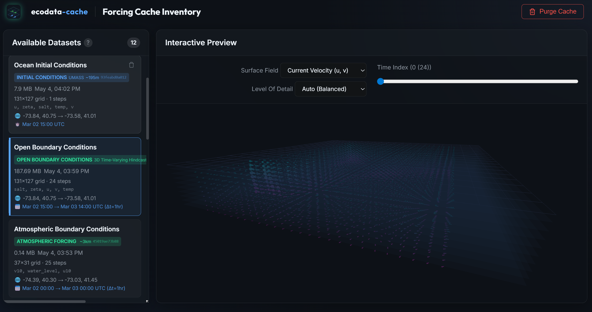

#  forcingkit

[](https://www.python.org/)
[](https://github.com/astral-sh/ruff)
[](https://opensource.org/licenses/Apache-2.0)

<div align="center">
  
</div>

Spatiotemporal forcing for computational Earth-system models: selects, regrids and serves model-ready time series with provenance.

`forcingkit` sits between operational and archive data providers (NOAA HRRR, NECOFS, NOAA OFS, HYCOM, NDBC, CO-OPS) and model codes such as `Oceananigans.jl`. It delivers a model's parent ocean on true z levels (`/api/v1/obc`) and its HRRR surface atmosphere on a regular grid (`/api/v1/atmosphere`), plus station observations for validation, as schema-versioned Zarr stores that record their sources.

forcingkit was named ecodata-cache until 2026-10-05; GitHub redirects the old repository URLs. The Python package is `forcingkit` (was `ecodata_cache`), and environment variables use the `FORCINGKIT_` prefix; the old names are still read, with a warning, until the next release. The routes removed on the same date are listed in [docs/source/removed_endpoints.rst](docs/source/removed_endpoints.rst).

## Goals

The primary goal of forcingkit is to provide clean, standardized ocean and atmospheric forcing boundaries for high-fidelity coastal hydrodynamic models. We achieve this by:

- Operating as an invisible, self-managing proxy service that orchestrates downloading and caching of remote data.
- Stripping away the quirks of individual forecasting nodes by harmonizing temporal alignment, grid structures, and variable naming conventions.
- Generating deterministic cache hashes to ensure simulation runs are 100% physically reproducible over time.

## Features

- **Decoupled System Architecture**: The microservice guarantees reproducible datasets by deterministic hashing, providing standardized local representations of external APIs.
- **Continuous Coupled Hindcasts**: Support for 45-to-60-day continuous hindcasts by dynamically stitching historical and operational HYCOM experiments.
- **Temporal Alignment**: Automated CF-compliant hourly interpolation across heterogeneous upstream timestamps and grid frequencies.

## Current Coverage

- **Oceanic Forcing**: NYOFS, NECOFS, DBOFS, HYCOM (Operational & Historical).
- **Atmospheric Forcing**: HRRR (3 km, hourly, 2014-07-30 to present), regridded to 0.03 degrees.

## Roadmap

- **Enhanced IOOS Coverage**: Expanding our data fetchers to support more regional nodes across the West Coast (WCOFS) and Gulf of Mexico (NGOFS2).
- **Improved Caching Policies**: Implementing dynamic cache invalidation based on NOAA operational forecast updates to ensure realtime predictions stay synchronized.
- **Variable Expansions**: Providing native spatiotemporal transformations for wave spectra and biogeochemical tracers.

## Architecture overview

The service exposes HTTP APIs (via FastAPI/Uvicorn) which:

1. Deterministically hash bounding boxes and time windows to generate an automated local Zarr cache (`~/.cache/forcingkit`).
2. Dispatch fetch operations via tiered fallback chains for high-availability. (e.g. DBOFS or NYOFS -> NECOFS -> HYCOM for the parent ocean).
3. Standardize dimensions, bounds, floating-point precision, and timezone offsets, providing a direct ingestion path for downstream coupled engines.

## Setup

```bash
uv sync
pre-commit install

# Development (single worker, run from the repository root):
uv run uvicorn service.forcingkit_serve.main:app --port 9598

# Service launcher (supports --host/--port/--workers/--reload):
uv run python service/run_server.py --host 0.0.0.0 --port 9598 --workers 4
```

## Docker Environment

The `Dockerfile` defaults to `ubuntu:24.04`, which is multi-arch. This service is
CPU-only, so the default works unchanged on x86_64 and on arm64 edge hardware;
`BASE_IMAGE` exists for cases that need a different base.

```bash
# x86_64 and arm64 alike (default)
docker build -t forcingkit .

docker run --rm -p 9598:9598 forcingkit
```

On NVIDIA Jetson under JetPack 7 (L4T R39, Ubuntu 24.04), keep the default base.
An earlier revision of this file recommended
`--build-arg BASE_IMAGE=nvcr.io/nvidia/l4t-base:r36.2.0`; that was wrong on two
counts. The `l4t-*` image family was never published beyond `r36.4.0`
(JetPack 6.1), so there is no R39 equivalent to move to, and this service needs
no CUDA in the image regardless. Where a CUDA base genuinely is required, the
JetPack 7 path is the unified `nvcr.io/nvidia/cuda:<ver>-*-ubuntu24.04` images,
which carry real arm64 manifests, combined with CDI device injection
(`--device nvidia.com/gpu=all`). Note that `--gpus all` is rejected on Tegra.

## Licensing

This project is licensed under the Apache 2.0 License.
