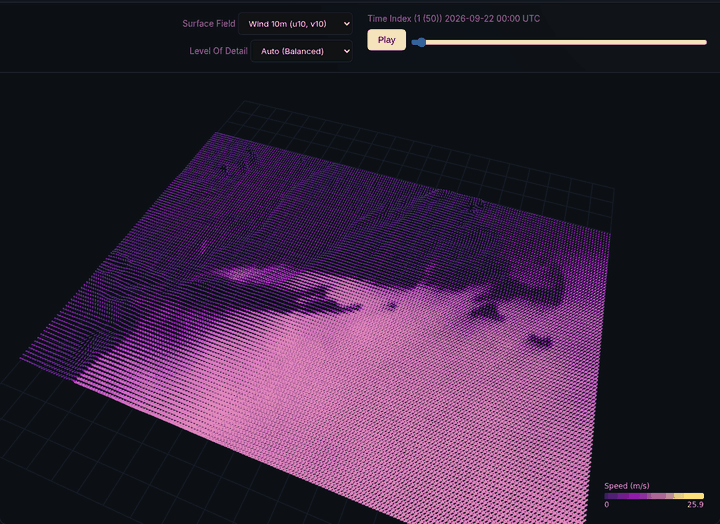

forcingkit
==========

**Spatiotemporal forcing for computational Earth-system models.** forcingkit selects, regrids
and serves model-ready time series, with a record of where every value came from.

         2026-09-22 00:00 to 2026-09-29 12:00 UTC
   :width: 720px
   :align: center

   HRRR 10 m wind served by forcingkit through the 26 to 27 September 2026 nor'easter, NY Bight
   to Cape Cod, every 3 hours from 22 to 29 September (peak 25.9 m/s), as played by the cache
   viewer's time slider.

What it does
------------

A regional ocean model needs three things from outside its own domain: the state of a larger
"parent" ocean along its open boundaries, the atmosphere above its surface, and the rivers that
flow into it. The first two come from
operational and archive systems (NOAA's `HRRR <https://rapidrefresh.noaa.gov/hrrr/>`__, the NOAA
`Operational Forecast Systems <https://tidesandcurrents.noaa.gov/models.html>`__,
`NECOFS <https://fvcom.smast.umassd.edu/?p=20>`__, `HYCOM <https://www.hycom.org/>`__) that
differ in grid type, vertical coordinate, time convention, file layout and access protocol, and
that change those details without notice. River discharge comes from stream gauges, which
measure flow upstream of the head of tide rather than at the mouth.

forcingkit is a FastAPI service that sits between those providers and model codes such as
`Oceananigans.jl <https://github.com/CliMA/Oceananigans.jl>`__ (for example through
`NumericalEarth <https://github.com/NumericalEarth/NumericalEarth.jl>`__). For a bounding box and a
time window it:

1. picks the source (the "donor") best suited to the box, and falls back to the next one if the
   first cannot deliver;
2. fetches only the subset it needs, over OPeNDAP, HTTPS or anonymous S3;
3. interpolates it to a regular longitude/latitude grid and, for the ocean, to fixed z levels in
   metres;
4. writes the result as a Zarr store with a versioned schema, its units, and the request that
   produced it; and
5. serves the same store again, without refetching, to any later request with the same
   parameters.

Store names are hashes of the request, including the schema version, so a run can be repeated
months later against the same forcing, and a store written under an older schema is never served
for a newer request.

What it serves
--------------

.. list-table::
   :header-rows: 1
   :widths: 34 66

   * - Route
     - Delivers
   * - ``POST /api/v1/obc``
     - The parent ocean (u, v, temperature, salinity, sea surface height) on a regular
       0.002 degree grid and fixed z levels, hourly, as schema ``z-v3``. The first record doubles
       as the initial condition. See :doc:`fetchers`, :doc:`necofs` and :doc:`nyofs`.
   * - ``POST /api/v1/atmosphere``
     - HRRR surface fields (10 m wind, 2 m temperature and humidity, pressure, radiation,
       precipitation) on a regular 0.03 degree grid, hourly, as schema ``hrrr-atm-v1``. See
       :doc:`atmospheric_forcing`.
   * - ``POST /api/v1/rivers``
     - Freshwater discharge at each listed river mouth in the box, hourly, from the tide-free
       `USGS <https://waterdata.usgs.gov/>`__ stream gauges upstream (chosen per request) scaled
       to the drainage area at the mouth, as schema ``river-v1``. See :doc:`rivers`.
   * - ``POST /api/v1/tide``
     - Observed water level at a `NOAA CO-OPS <https://tidesandcurrents.noaa.gov/>`__ station, for
       validation.
   * - ``POST /api/v1/ndbc``
     - `NDBC <https://www.ndbc.noaa.gov/>`__ buoy meteorology and ADCP current profiles, for
       validation.
   * - ``POST /api/v1/telemetry/station``, ``POST /api/v1/telemetry/bbox``
     - Water-column profiles from the `UConn Marine Sciences <https://marinesciences.uconn.edu/>`__
       `ERDDAP server <http://merlin.dms.uconn.edu:8080/erddap/index.html>`__, by station or by box.
   * - ``/api/v1/cache/...`` and ``/ui/``
     - The cache viewer: an inventory of every store, with 2D and 3D previews.

Each generating route has ``/download/{zarr_id}`` and, for the parent ocean, ``/cache`` and
``/predict-donor`` companions. The running service publishes its full OpenAPI description at
``/docs``.

Parent-ocean donors at a glance
-------------------------------

.. list-table::
   :header-rows: 1
   :widths: 14 22 18 22 24

   * - Donor
     - Model and grid
     - Resolution
     - Coverage served
     - Status in forcingkit
   * - :doc:`NYOFS <nyofs>`
     - POM, curvilinear, 7 sigma levels
     - About 140 to 1000 m (median 340 m)
     - NY/NJ Harbor; 2014 to the present
     - Legacy output, not ``z-v3``
   * - DBOFS
     - ROMS, curvilinear
     - About 100 m
     - Delaware Bay and offshore New Jersey
     - Legacy output, not ``z-v3``
   * - :doc:`NECOFS <necofs>`
     - FVCOM GOM7, unstructured, 45 sigma layers
     - About 130 to 800 m in the NY Harbor and Long Island Sound region
     - Gulf of Maine to the Mid-Atlantic Bight; daily archive from 2025-01-01
     - Streams ``z-v3`` hour by hour; the recommended donor
   * - :doc:`HYCOM <hycom>`
     - HYCOM GLBv0.08, GLBy0.08 and ESPC-D-V02, regular
     - 1/12 degree (about 9 km)
     - Global; 1994 to the present
     - Legacy output; last-resort fallback; tidal only from 2024-09-05

Quick start
-----------

.. code-block:: bash

   uv sync
   uv run uvicorn service.forcingkit_serve.main:app --port 9598

Then request 24 hours of parent ocean for a box in central Long Island Sound, which NECOFS
serves:

.. code-block:: bash

   curl -s -X POST http://localhost:9598/api/v1/obc \
     -H 'Content-Type: application/json' \
     -d '{"bbox": {"min_lon": -73.20, "min_lat": 40.95, "max_lon": -73.00, "max_lat": 41.10},
          "start_date": "2026-09-26T00:00:00Z", "duration_hours": 24}'

The response names the store (``zarr_id``, ``zarr_path``, ``download_url``), the donor that
delivered it (``donor``) and the donor ranked first for the box (``predicted_donor``). A
second identical request returns ``"status": "cached"`` immediately. Stores live under
``FORCINGKIT_CACHE_DIR`` (default ``~/.cache/forcingkit``).

The data forcingkit serves belongs to the institutions that produce it; :doc:`sources` lists them,
with their terms of use and the papers to cite.

Contributions are welcome, from a corrected archive path to a new region. :doc:`roadmap` lists
the parent-ocean and atmosphere sources that would add most next, coverage first and resolution
second (Copernicus GLO12 and GLORYS12, the remaining NOAA forecast systems, the Doppio
reanalysis, HRRR Alaska, and a first European pair from Copernicus Marine among them), and what
a new source needs.

Source, issues and releases: https://github.com/lhzn-io/forcingkit. The package is published on
PyPI as ``forcingkit``.

.. toctree::
   :maxdepth: 2
   :caption: Sources

   fetchers
   necofs
   nyofs
   hycom
   atmospheric_forcing
   rivers

.. toctree::
   :maxdepth: 1
   :caption: Reference

   sources
   roadmap
